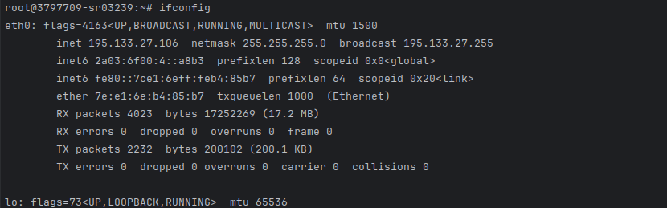
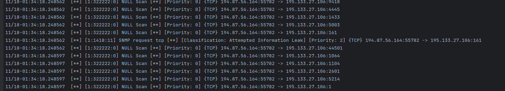
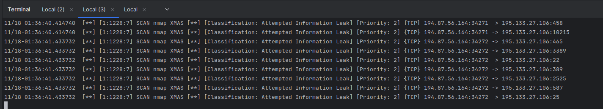

# Отчёт по лабораторной работе №10

## Выполненные шаги

### Часть 1

1. Узнал свой публичный ip

2. Установил snort и сконфигурировал защиту сети

3. Запустил snort - sudo service snort start

4. Настроил правило 
alert tcp any any -> any any (content:»https://www.google.ru/» ;
msg:»Someone open Google website» ; sid: 12312313;)

5. Настроил правило
alert tcp any any -> any any (msg:»NULL Scan»; flags: 0; sid:322222;)

6. ПРовёл сканиование null пакетами с 2 VM и получил alert от snort:

7. Также провёл сканирование иными способами, например XMAS:

### Часть 2

Не удалось выполнить ввиду отсутствия доступа к splunk из-за embargo
