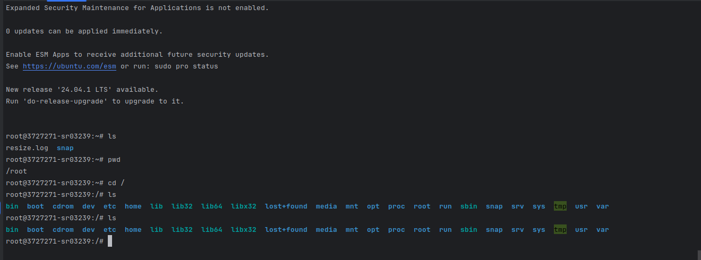
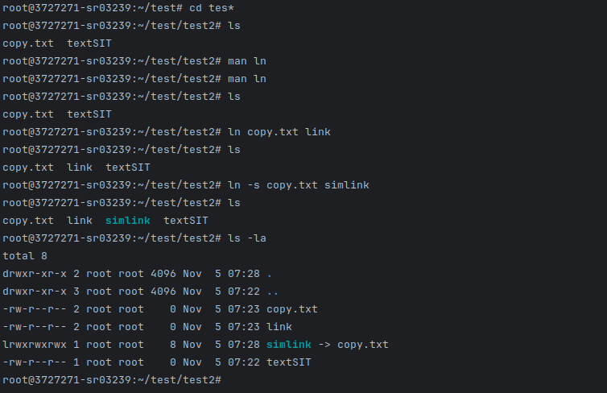
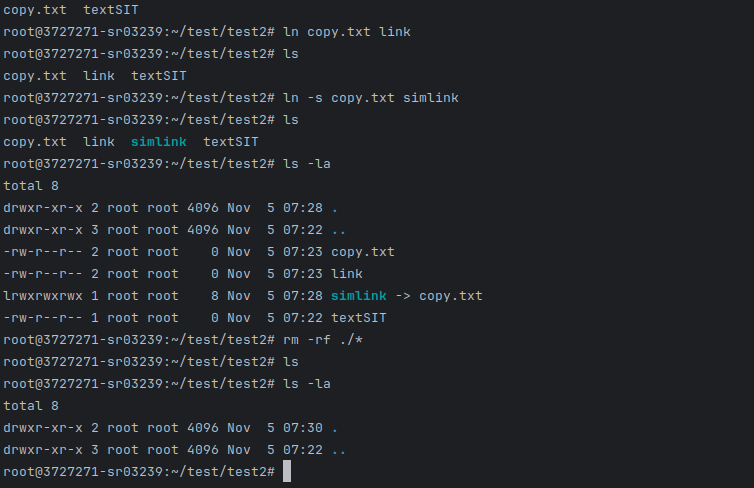

# Отчёт по лабораторной работе №3

## Выполненные шаги

1. Откройте терминал.
2. Ознакомьтесь с возможностями команды pwd c помощью команды
3. Определите текущий каталог, в котором вы находитесь командой
4. Ознакомьтесь с возможностями команды cd c помощью команды man
5. Перейдите в корневой каталог командой cd
6. Ознакомьтесь с возможностями команды ls c помощью команды man
7. Просмотрите содержимое корневого каталога командой ls
8. Сделайте копию экрана для использования в отчете по лабораторной
работе

9. Вернитесь в домашний каталог, используя команду cd без параметров
10. Ознакомьтесь с возможностями команды mkdir c помощью команды
man
11. Создайте каталог «test», используя команду mkdir
12. Перейдите в каталог «test», используя команду cd
13. Просмотрите содержимое каталога, используя команду ls
14. Создайте каталог «test2», используя команду mkdir
15. Ознакомьтесь с возможностями команды touch c помощью команды
man
16. Создайте файл «text» в каталоге «test2» используя команду touch
17. Ознакомьтесь с возможностями команды mv c помощью команды
man
18. Переименуйте файл «text» в «textSIT» используя команду mv
19. Ознакомьтесь с возможностями команды cp c помощью команды
man
20. Скопируйте файл «textSIT» в каталог «test2» под именем «copy.txt»,
используя команду cp
21. Ознакомьтесь с возможностями команды ln c помощью команды
22. Создайте жесткую ссылку «link» на файл «copy.txt» используя
команду ln
23. Создайте символическую ссылку «simlink» на файл «copy.txt»
используя команду ln
24. Просмотрите результаты в текущем каталоге при помощи команды
ls с аргументами la
25. Сделайте копию экрана для использования в отчете по лабораторной
работе.

26. Удалите созданные вами файлы и ссылки в лабораторной работе
используя команду rm
27. Сделайте копию экрана для использования в отчете по лабораторной
работе

