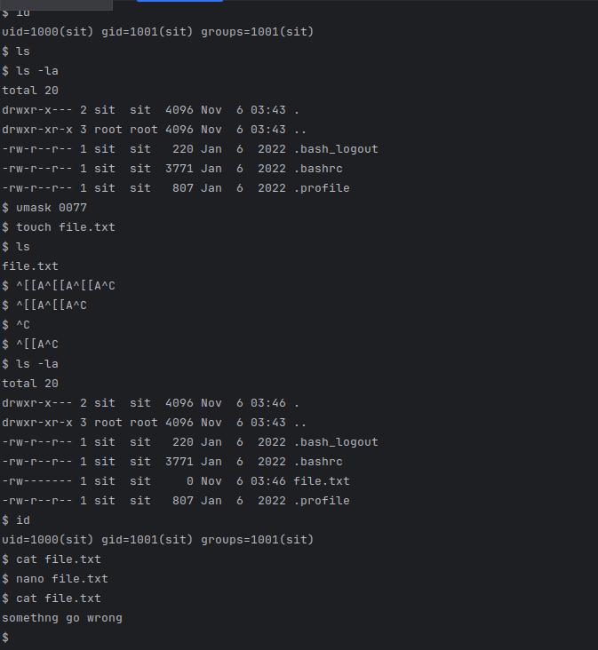
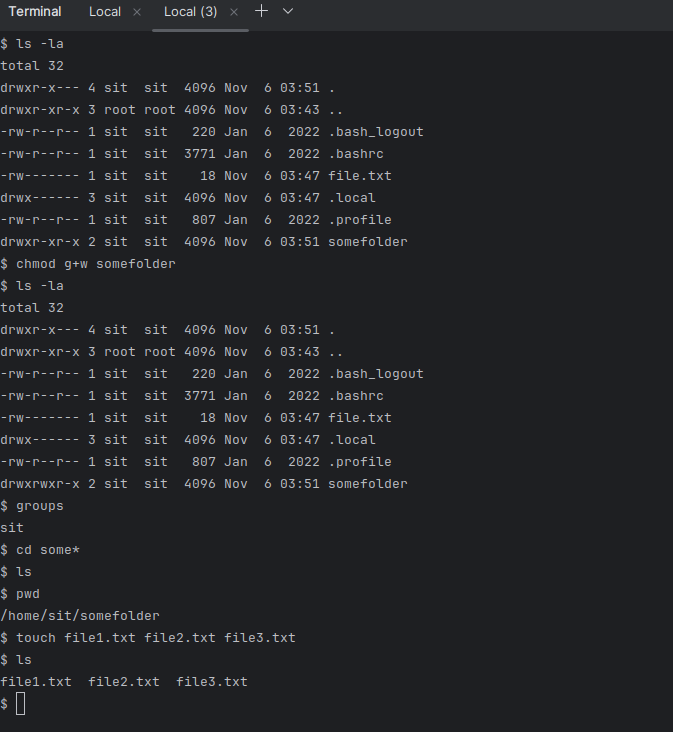
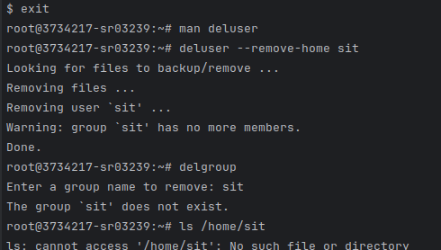
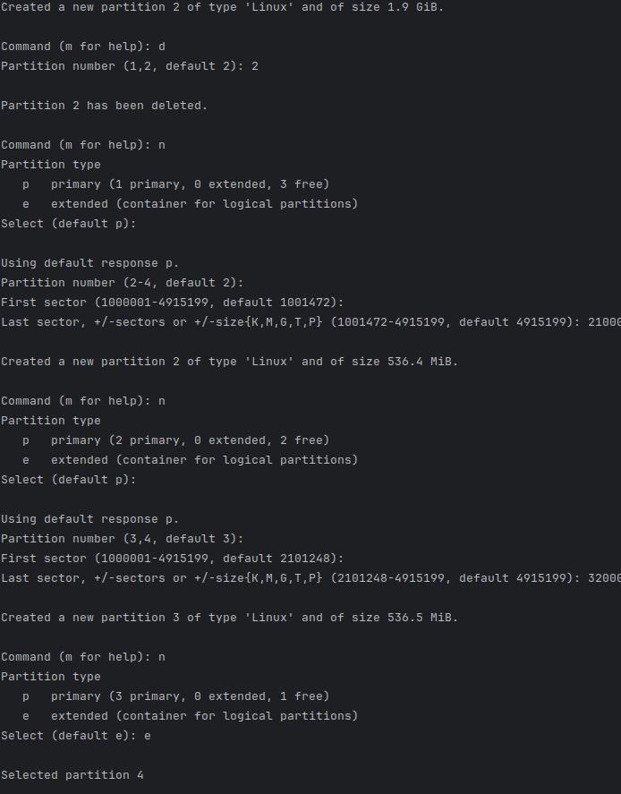
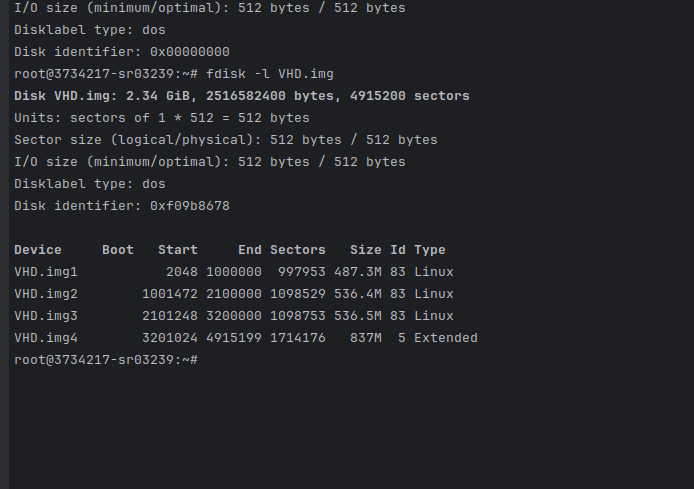
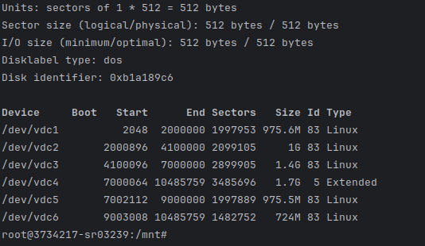
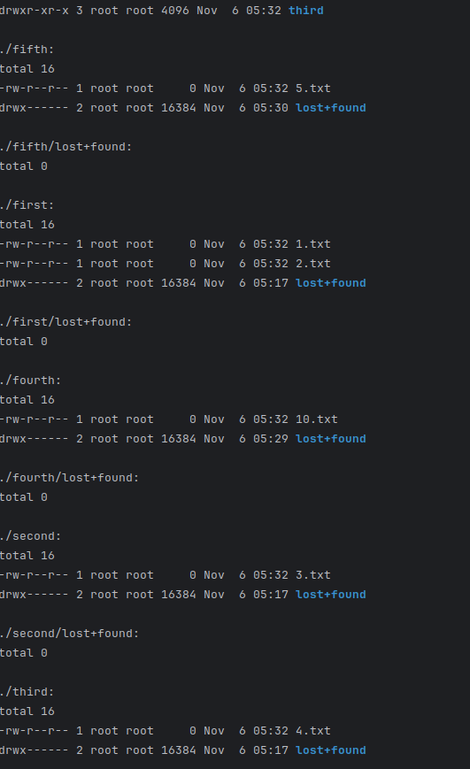

# Отчёт по лабораторной работе №4

## Выполненные шаги

1. Войти под пользователем sit
   1. Создадим пользователя - useradd -m -d /home/sit/ sit
   2. Присвоим пароль - passwd sit
   3. Переключимся на sit - su sit
2. Посмотрите какой идентификатор получил пользователь, используя
команду id.
3. Посмотрите права доступа на домашний каталог, используя команду
ls.
4. Создайте файл с маской 0077 используя umask.
5. Попробуйте прочитать его содержимое используя команду cat.
6. Запишите текстовую информацию в файл, используя консольный
текстовый редактор vi или nano.
7. Проверьте права на файл, и прочитайте его содержимое.

8. Создайте каталог.
9. Установите права записи для группы пользователей на данный
каталог.
10. Проверьте в какие группы входит пользователь.
11. Создайте несколько файлов в каталоге.

12. Ознакомьтесь как удалить пользователя вместе с содержимым его
домашнего каталога из справочной документации. - deluser --remove-home sit
13. Удалите пользователя вместе с его домашним каталогом.

Создание виртуального диска в виде "файла" - sudo dd if=/dev/zero of=VHD.img bs=1M count=2400

Создадим партиции с помщью fdisk

Разметка ext4 - sudo mkfs -t ext4 VHD.img

Создадим каталог - sudo mkdir /mnt/VHD/

Примонтируем - sudo mount -t auto -o loop VHD.img /mnt/VHD/

https://pq.hosting/help/razbivka-diska-na-razdely-v-linux

Не удалось сделать с виртуальным ЖД в виде .img, поэтому был подключен дополнительный ЖД

# Команды для стирания и восстановления MBR

dd if=/dev/vdc of=/backup/vdc.bak bs=512 count=1
dd if=/dev/zero of=/dev/vdc bs=512 count=1
dd if=/backup/vdc.bak of=/dev/vdc bs=512 count=1
