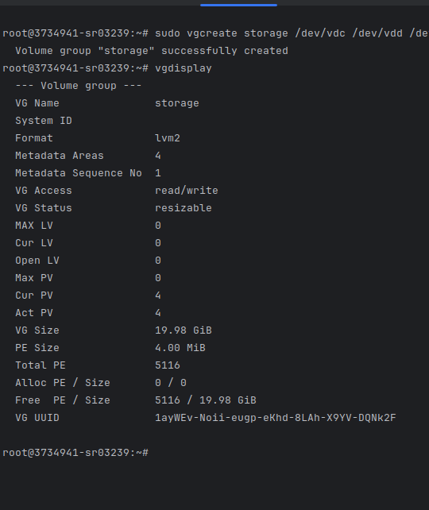

# Отчёт по лабораторной работе №5

## Выполненные шаги

### ЧАСТЬ 1:

1. Следим за изменением в /proc/mdstat - sudo watch -n1 cat /proc/mdstat

2. Создадим raid1 массив - sudo mdadm -C /dev/md0 -l 1 -n 4 -x 1 /dev/vd[c-g]

Информция о raid-массиве

3. Создаём файловую систему ext4 на md0: sudo mkfs -t ext4 /dev/md0

4. Монтируем md0 к /mnt/md0: mkdir /mnt/raid1 && sudo mount /dev/md0 /mnt/raid1

5. Создаем текстовый файл и заполняем данными: touch /mnt/raid1/file.txt && echo "test-data1234" >> /mnt/raid1/file.txt

6. Разрушаем 1 из дисков

7. Стираем информацию о raid1

mdadm -S /dev/md0
dd if=/dev/zero of=/dev/vd[c-g] bs=1M count=5000

8. Создадим raid0 массив - sudo mdadm -C /dev/md0 -l 1 -n 5 /dev/vd[c-g]

9. Создаём файловую систему ext4 на md0: sudo mkfs -t ext3 /dev/md0

10. Монтируем md0 к /mnt/raid1: mkdir /mnt/raid0 && sudo mount /dev/md0 /mnt/raid1

11. Создаем текстовый файл и заполняем данными: touch /mnt/raid0/file.txt && echo "test-data1234" >> /mnt/raid0/file.txt

12. Разрушаем 1 из дисков

Данные сохранились, но каталог стал readonly

13. Стираем информацию о raid0

umount /mnt/raid1
mdadm -S /dev/md0
dd if=/dev/zero of=/dev/vd[c-g] bs=1M count=5000

14. Создадим raid5 массив - sudo mdadm -C /dev/md0 -l 5 -n 4 -x 1 /dev/vd[c-g]

15. Создаём файловую систему ext4 на md0: sudo mkfs -t ext4 /dev/md0

16. Монтируем md0 к /mnt/raid5: mkdir /mnt/raid5 && sudo mount /dev/md0 /mnt/raid5

17. Создаем текстовый файл и заполняем данными: touch /mnt/raid5/file.txt && echo "test-data1234" >> /mnt/raid5/file.txt

18. Разрушаем 3 из дисков

umount /mnt/raid5
mdadm -S /dev/md0
dd if=/dev/zero of=/dev/vd[c-g] bs=1M count=5000

19. Создадим raid10 массив - sudo mdadm -C /dev/md0 -l 10 -n 4 -x 1 /dev/vd[c-g]

20. Создаём файловую систему ext2 на md0: sudo mkfs -t ext2 /dev/md0

21. Монтируем md0 к /mnt/raid10: mkdir /mnt/raid10 && sudo mount /dev/md0 /mnt/raid10

22. Создаем текстовый файл и заполняем данными: touch /mnt/raid10/file.txt && echo "test-data1234" >> /mnt/raid10/file.txt

23. Разрушаем 2 из дисков

umount /mnt/raid10
mdadm -S /dev/md0
dd if=/dev/zero of=/dev/vd[c-g] bs=1M count=5000

### ЧАСТЬ 2:

pvdisplay - просмотр физических томов
lvdisplay - просмотр логических томов
vgdisplay - просмотр групп

1. sudo pvcreate /dev/vd[c-f] - Создаем дескрипторы для диска

2. Создаем группу томов - sudo vgcreate storage /dev/vdc /dev/vdd /dev/vde /dev/vdf

3. Создаем логический том - sudo lvcreate -l100%FREE -n sit storage

4. sudo mkfs -t ext4 /dev/storage/sit - форматируем под ext4
5. mkdir /mnt/sit && mount /dev/storage/sit /mnt/sit - монтируем
6. Создаем файл LVM.txt - touch /mnt/sit/LVM.txt

7. Создадим дескриптор для ещё 1 винчестера - sudo pvcreate /dev/vdg
8. Расширим группу томов на ещё 1 pv - sudo vgextend storage /dev/vdg
9. Расширяем логический том - sudo lvextend -l6395 /dev/storage/sit

10. Отмонтируем устройство - sudo umount /mnt/sit
11. Просканируем существуюшую файловую систему - e2fsck -f /dev/storage/sit
12. Расширим файловую систему - resize2fs /dev/storage/sit

13. Создадим снапшот - sudo lvcreate -s -L5GB -n backup /dev/storage/sit

14. Удаляем среды пребывания

### ЧАСТЬ 3:

1. Создал партиции на диске с помощью fdisk
2. Разметил партиции с ext4 - sudo mkfs -t ext4 /dev/vdg1 && sudo mkfs -t ext4 /dev/vdg2

3. Ставим TestDisk - sudo apt-get install testdisk
4. Накроем медным тазом MBR на диске - dd if=/dev/zero of=/dev/vdg bs=512 count=1

5. Восстановил партиции с помощью sudo testdisk

6. Примонтируем один из разделов - sudo mkdir /mnt/vdg2 && sudo mount /dev/vdg2 /mnt/vdg2
7. Создадим файлы - touch /mnt/vdg2/test1.txt /mnt/vdg2/test2.txt && echo "stuf1" >> /mnt/vdg2/test1.txt && echo "stuff2" >> /mnt/vdg2/test2.txt 
8. Удалим файлы - rm /mnt/vdg2/test1.txt /mnt/vdg2/test2.txt
9. Восстановим с помощью testdisk

10. Скопируем /var/log/ в /mnt/vdg2/copy-log
11. удалим /mnt/vdg2/copy-log

12. Данные востановленные с помощью photorec

12. Данные востановленные с помощью Extendulete - sudo extundelete /dev/vdg2 -restore-directory /copy-log

