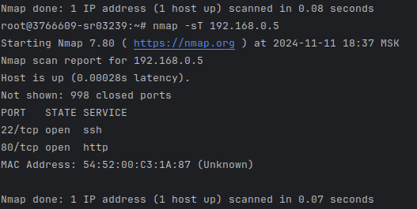
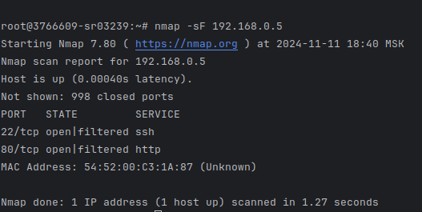
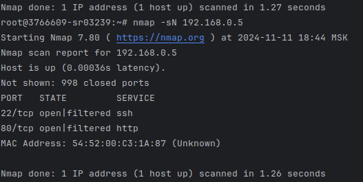
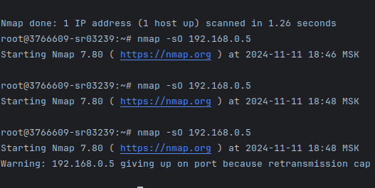
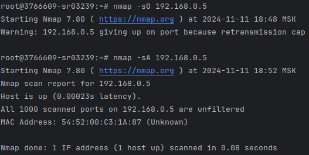
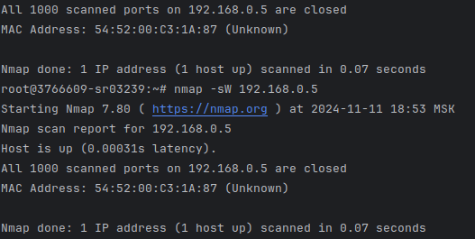
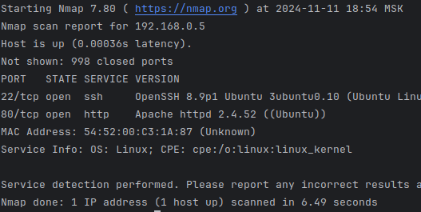

# Отчёт по лабораторной работе №6

## Выполненные шаги

1. Настроил облако с двумя vps, подключенными к vpc
2. Установил apache2 на 2 машину - sudo apt-get install apache2
3. Установил nmap на 1 машину - sudo apt-get install nmap

4. TCP Connect - nmap -sT 192.168.0.5

5. TCP-SYN - nmap -sS 192.168.0.5

6. Fin - nmap -sF 192.168.0.5

6. XmasTree - nmap -sX 192.168.0.5

7. NULL - nmap -sN 192.168.0.5

8. PROTOCOL IP - nmap -sO 192.168.0.5

9. ACK - nmap -sA 192.168.0.5

10. TCP Window - nmap -sW 192.168.0.5

11. RPC Сканирование - nmap -sR 192.168.0.5

11. Сканирование ОС - nmap -O 192.168.0.5

