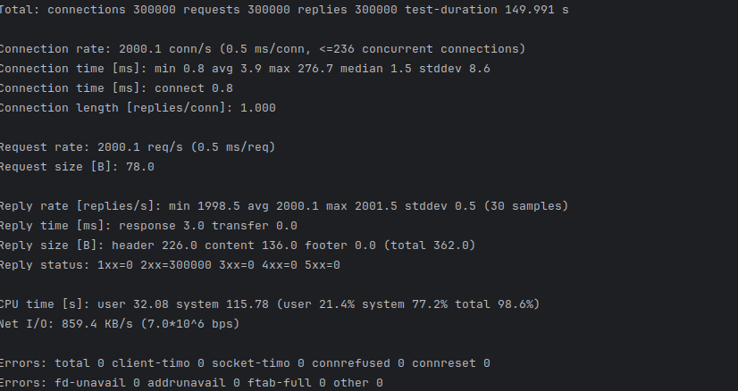
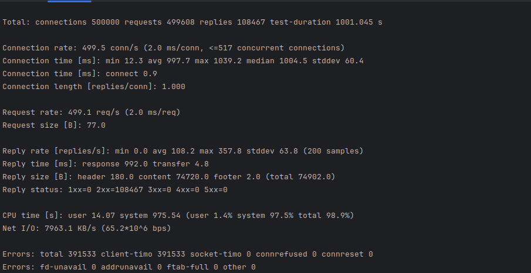
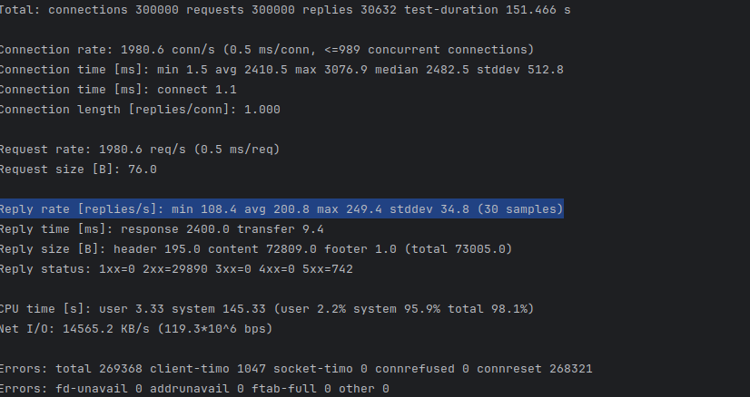
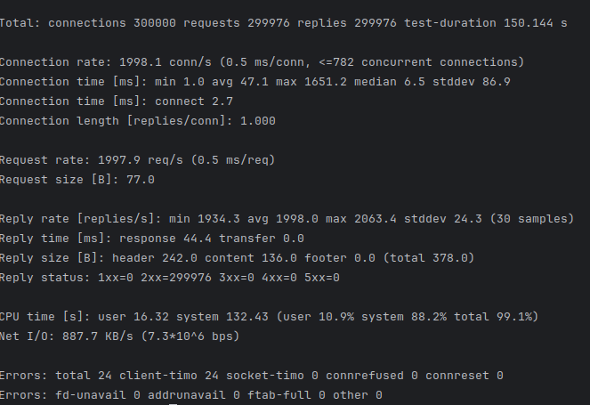
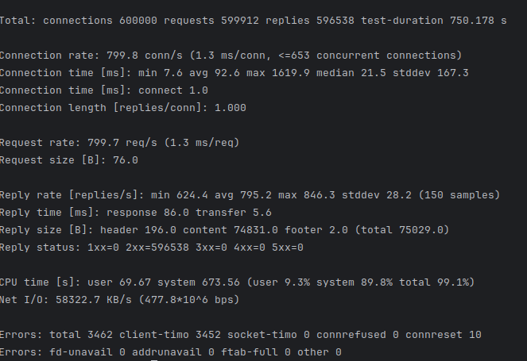
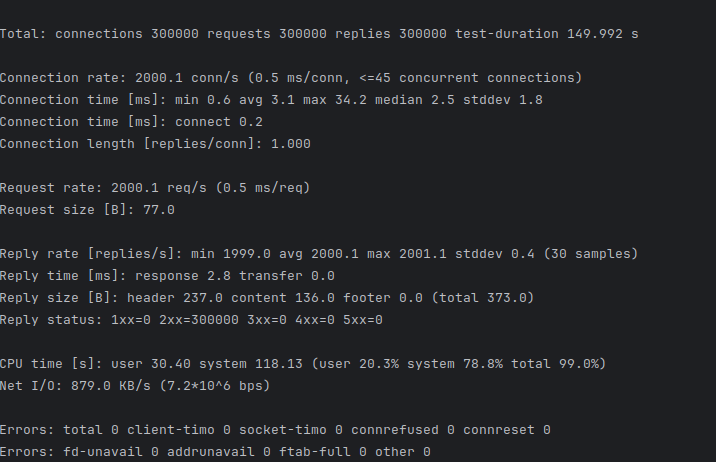
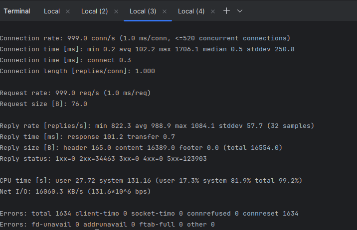

# Отчёт по лабораторной работе №7

Характеристики VMs:

ОЗУ - 2 гб
ЦП - 1 x 3.3 ГГц CPU

## Команды для тестирования:

1. httperf --port=80 --server=<domain> --uri=<uri> --num-conns=100 --rate=10

## Выполненные шаги

1. Настроил облако с тремя vps, используя terraform
2. Развернул apache, nginx на VMs

3. Провёл тестирование apache

httperf --port=80 --server=176.124.214.190 --uri=/index.html --num-conns=300000 --rate=2000 --timeout=3

Reply rate [replies/s]: min 1998.5 avg 2000.1 max 2001.5 stddev 0.5 (30 samples)

httperf --port=80 --server=176.124.214.190 --uri=/index.php --num-conns=600000 --rate=800 --timeout=1

Reply rate [replies/s]: min 0.0 avg 108.2 max 357.8 stddev 63.8 (200 samples)

4. Провёл тестирование nginx

httperf --port=80 --server=176.124.215.82 --uri=/index.html --num-conns=300000 --rate=2000 --timeout=3

Reply rate [replies/s]: min 1967.5 avg 1999.7 max 2053.8 stddev 15.6 (30 samples)

httperf --port=80 --server=176.124.215.82 --uri=/index.php --num-conns=300000 --rate=2000 --timeout=3

Reply rate [replies/s]: min 108.4 avg 200.8 max 249.4 stddev 34.8 (30 samples)

5. Настроил облако с 7 vps, используя terraform
6. Развернул apache, nginx, nginx-lb на VMs

7. Провёл тестирование 2 apache проксируя через nginx

httperf --port=80 --server=91.222.236.235 --uri=/index.html --num-conns=300000 --rate=2000 --timeout=3

Reply rate [replies/s]: min 1934.3 avg 1998.0 max 2063.4 stddev 24.3 (30 samples)

httperf --port=80 --server=91.222.236.235 --uri=/index.php --num-conns=600000 --rate=800 --timeout=1

Reply rate [replies/s]: min 624.4 avg 795.2 max 846.3 stddev 28.2 (150 samples)

8. Провёл тестирование 2 nginx проксируя через nginx

httperf --port=80 --server=188.225.38.229 --uri=/index.html --num-conns=300000 --rate=2000 --timeout=3

Reply rate [replies/s]: min 1999.0 avg 2000.1 max 2001.1 stddev 0.4 (30 samples)

httperf --port=80 --server=188.225.38.229 --uri=/index.php --num-conns=300000 --rate=2000 --timeout=3

Reply rate [replies/s]: min 822.3 avg 988.9 max 1084.1 stddev 57.7 (32 samples)
Reply time [ms]: response 101.2 transfer 0.7
Reply size [B]: header 165.0 content 16389.0 footer 0.0 (total 16554.0)
Reply status: 1xx=0 2xx=34463 3xx=0 4xx=0 5xx=123903

## Итоги

<table>
  <thead>
    <tr>
      <td></td>
<td></td>
      <td>Максимальное
число запросов</td>
      <td>Запросы/сек</td>
      <td>Время,
затрачиваемое на
запрос, мс</td>
      <td>% 
успешных
запросов</td>
    </tr>
  </thead>
  <tbody>
    <tr>
      <td>Apache</td>
      <td>PHP</td>
      <td>357</td>
      <td>108</td>
      <td>2</td>
      <td>21</td>
    </tr>
    <tr>
      <td></td>
      <td>HTML</td>
      <td>2000</td>
      <td>2000</td>
      <td>0.5</td>
      <td>100</td>
    </tr>
    <tr>
      <td>LB +</td>
      <td>PHP</td>
      <td>800</td>
      <td>800</td>
      <td>1.3</td>
      <td>99</td>
    </tr>
    <tr>
      <td>Apache</td>
      <td>HTML</td>
      <td>2000</td>
      <td>2000</td>
      <td>0.5</td>
      <td>100</td>
    </tr>
    <tr>
      <td>Nginx</td>
      <td>PHP</td>
      <td>2000</td>
      <td>2000</td>
      <td>0.5</td>
      <td>9</td>
    </tr>
    <tr>
      <td></td>
      <td>HTML</td>
      <td>2000</td>
      <td>2000</td>
      <td>0.5</td>
      <td>100</td>
    </tr>
    <tr>
      <td>LB +</td>
      <td>PHP</td>
      <td>1000</td>
      <td>1000</td>
      <td>1</td>
      <td>20</td>
    </tr>
    <tr>
      <td>Nginx</td>
      <td>HTML</td>
      <td>2000</td>
      <td>2000</td>
      <td>0.5</td>
      <td>100</td>
    </tr>
  </tbody>
</table>
