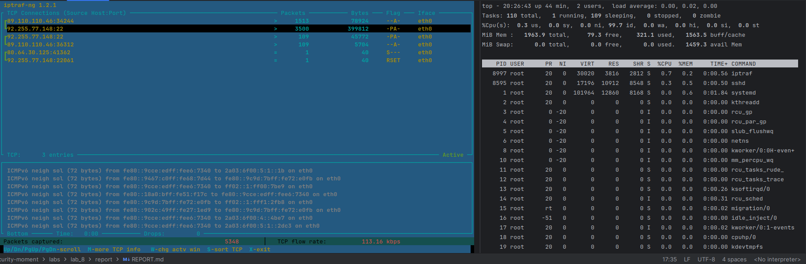

# Отчёт по лабораторной работе №8

## Выполненные шаги

### Часть 1

1. Настроил облако с двумя vps и установил nginx на сервер

2. Установил ПО для мониторинга атакуемого сервера
   - nload
   - iptraf
   - top (стандартный)

3. Установил ПО на атакующий сервер
   - [slowloris](https://github.com/gkbrk/slowloris) - для медленных атак slowloris
     - sudo pip3 install slowloris
     - slowloris <domain/address> -p <port> -s <amount>
   - [torshammer](https://github.com/Karlheinzniebuhr/torshammer) - для медленных атак post/get
     - git clone https://github.com/Karlheinzniebuhr/torshammer.git
     - cd torshammer
     - python torshammer.py -t <domain/socket> -p <port>
   - [hping3](https://clouddocs.f5.com/training/community/firewall/html/class2/ddos2.html) - для flood
     - sudo apt install hping3
     - hping3 <domain/address> --flood --rand-source --icmp -c 25000 

4. Мониторим начальное состояние системы

5. Проведём атаку slowloris на nginx
    - Отмечу, что необходимо изменить ограничение на кол-тво 
      открытых файлов на атакующей машине - ulimit -S -n $(ulimit -Hn)
    - В процессе атаки был достигнут LA за последнюю минуту около 0.4
    
    - Nginx был выведен из строя ввиду превышения worker_connections
    
    - Проведём работы по защите сервера nginx [руководство](https://blog.imkhoi.com/posts/2023/10/slowloris-ddos-and-how-to-mitigate-with-nginx/)
    - Установим ограничение на длительность 5 секунд для подключения, также ограничим на 10 подключений с одного ip
    - iptables -A INPUT -p tcp --syn --dport 80 -m connlimit --connlimit-above 30 -j DROP
    - iptables -I INPUT -p tcp --dport 80 -m state --state NEW -m recent --set
    - iptables -I INPUT -p tcp --dport 80 -m state --state NEW -m recent --update --seconds 30 --hitcount 10 -j DROP
    

6. Проведём атаку hping3 на nginx (sym flood)
    - В процессе атаки был достигнут LA 0.8, также http сервер был недоступен
    
    hping3 -S -p 80 --flood 92.255.77.148
    -  - также большое количество tcp пакетов

### Часть 2

1. Установите web-сервер <sudo apt-get install apache2>
2. Просмотрите список текущих правил iptables таблицы filter
sudo iptables -L
3. Вы увидите, что список содержит три цепочки по умолчанию
(INPUT, OUTPUT и FORWARD), в каждой из которых установлена политика
по умолчанию (на данный момент это ACCEPT).
4. С помощью команды <sudo iptables -S> данный список можно
просмотреть в другом формате, который отражает команды, необходимые
для активации правил и политик.
5. Чтобы сбросить текущие правила (если таковые есть), наберите:
sudo iptables -F
6. Цепочка INPUT отвечает за входящий траффик.
7. Чтобы внести локальный интерфейс выполните:
sudo iptables -A INPUT -i lo -j ACCEPT
8. Чтобы заблокировать весь исходящий трафик, кроме портов для SSH
и веб-сервера, нужно сначала разрешить подключения к этим портам. В
цепочку ACCEPT добавьте два порта (порт SSH 22 и порт http 80), что
разрешит трафик на эти порты.
sudo iptables -A INPUT -p tcp -m tcp --dport 22 -j ACCEPT
sudo iptables -A INPUT -p tcp -m tcp --dport 80 -j ACCEPT
9. В данной работе мы используем SSH.
10. Нужно добавить еще одно правило, которое позволит
устанавливать исходящие соединения (т.е. использовать ping или запускать
обновления программного обеспечения):
sudo iptables -I INPUT -m state --state ESTABLISHED,RELATED -j ACCEPT
11. Создав все эти правила, можно заблокировать все остальное и
разрешить все исходящие соединения.
sudo iptables -P OUTPUT ACCEPT
sudo iptables -P INPUT DROP
12. Просмотрите список правил
sudo iptables -L
13. Добавим еще несколько правил для блокировки наиболее
распространенных атак. Для начала нужно заблокировать нулевые пакеты
<sudo iptables -A INPUT -p tcp --tcp-flags ALL NONE -j DROP>.
14. Следующее правило отражает атаки syn-flood <sudo iptables -A
INPUT -p tcp ! --syn -m state --state NEW -j DROP>. Теперь фаервол не будет
принимать входящих пакетов с tcp-флагами. Нулевые пакеты, по сути,
разведывательные. они используются, чтобы выяснить настройки сервера и
определить его слабые места.
15. Далее нужно защитить сервер от разведывательных пакетов XMAS
<sudo iptables -A INPUT -p tcp --tcp-flags ALL ALL -j DROP>. Теперь сервер
защищен от некоторых общих атак, которые ищут его уязвимости.
16. Со второй виртуальной машиины, на которую установите nmap,
проведите XMAS сканирование <sudo nmap -sX>.

17. По умолчанию все не сохраненные правила действуют до
следующей перезагрузки сервера; сразу же после перезагрузки не
сохраненные правила будут потеряны. Самый простой способ загрузить
пакет iptables-persistent <sudo apt-get install iptables-persistent>. Во время
инсталляции пакет уточнит, нужно ли сохранить текущие правила для
дальнейшей автоматической загрузки, если текущие правила были
протестированы и соответствуют всем требованиям, их можно сохранить.

### ЧАСТЬ 3

1. На виртуальную машину Server необходимо установить набор
программного обеспечения LAMP (Linux Apache MySQL PHP)
sudo apt-get update
sudo apt-get install tasksel
sudo tasksel
Выберите LAMP. Чтобы отметить выделите и нажмите пробел. И
нажмите Enter.
2. Установите mod_security <sudo apt-get install libapache2-modsecurity2>
3. Выполните команду <sudo apachectl -M | grep --color security2>. Если
на экране появился модуль по имени security2_module (shared), значит, все
прошло успешно.
4. В каталоге логов Apache можно найти новый лог-файл для
mod_security. /var/log/apache2/modsec_audit.log
5. Установка ModSecurity включает в себя конфигурационный файл,
который нужно переименовать: <sudo mv /etc/modsecurity/modsecurity.confrecommended /etc/modsecurity/modsecurity.conf>.
6. Затем перезапустите Apache <sudo service apache2 reload>.
7. Стандартный конфигурационный файл настроен на DetectionOnly, то
есть, фаервол только отслеживает логи, при этом ничего не блокируя. Чтобы
изменить это поведение, отредактируйте файл modsecurity.conf: <sudo nano
/etc/modsecurity/modsecurity.conf>
8. Найдите в файле строку: «SecRuleEngine DetectionOnly». И измените
ее так: «SecRuleEngine On».
9. Найдите «SecResponseBodyAccess On» и замените на
«SecResponseBodyAccess Off». Эта директива отвечает за буферизацию тела
ответа; ее рекомендуется включать, только если требуется обнаружение и
предохранение от утечки данных. Включенная директива
(SecResponseBodyAccess On) не только будет использовать больше ресурсов
сервера, но и увеличит размер лог-файла, следовательно, ее желательно
отключить.
10. По умолчанию mod_security поставляется с базовым набором
правил CRS (Core Rule Set), которые находятся в /usr/share/modsecurity-crs/
11. Чтобы подгрузить эти готовые правила, нужно, чтобы веб-сервер
Apache читал указанные выше каталоги. Для этого отредактируйте файл
mod-security.conf:
sudo nano /etc/apache2/mods-enabled/mod-security.conf
12. Между <IfModule security2_module> </IfModule> внесите
следующие параметры:
Include "/usr/share/modsecurity-crs/*.conf"
Include "/usr/share/modsecurity-crs/activated_rules/*.conf"
13. Директория activated_rules аналогична директории Apache
mods-enabled. Правила доступны в каталогах: /usr/share/modsecuritycrs/base_rules ; /usr/share/modsecurity-crs/optional_rules ; /usr/share/modsecuritycrs/experimental_rules
14. Чтобы активировать правила, нужно создавать символические
ссылки в каталоге activated_rules. <cd /usr/share/modsecuritycrs/activated_rules/>
15. Добавьте несколько правил, например <sudo ln -s
/usr/share/modsecurity-crs/base_rules/modsecurity_crs_30_http_policy.conf> ;
<sudo ln -s /usr/share/modsecuritycrs/base_rules/modsecurity_crs_49_generic_attacks.conf>
16. Чтобы новые правила вступили в исполнение, нужно перезапустить
Apache <sudo service apache2 reload>