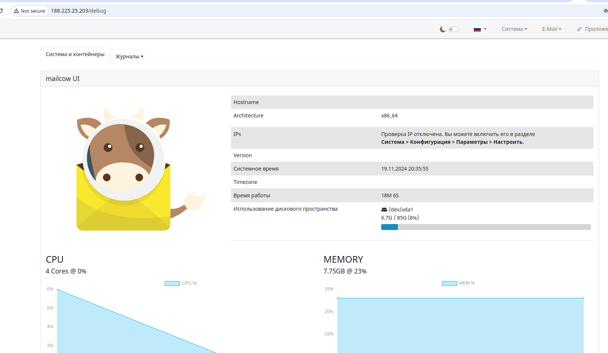
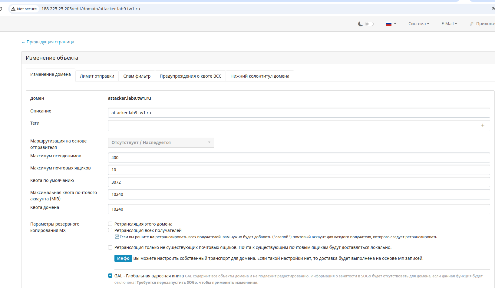
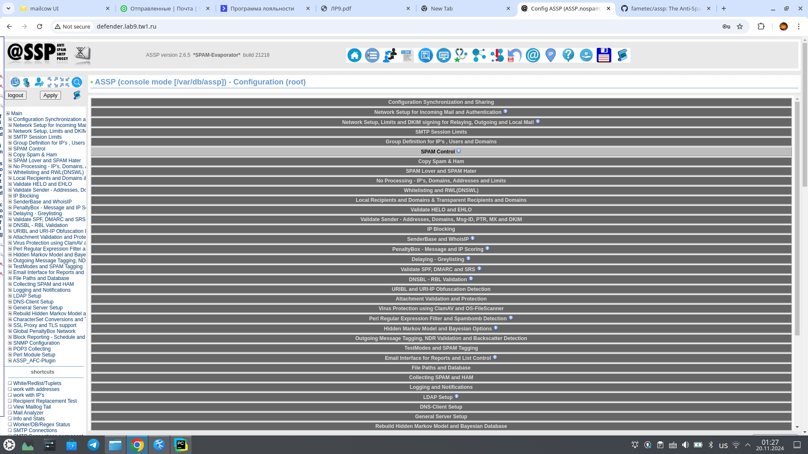
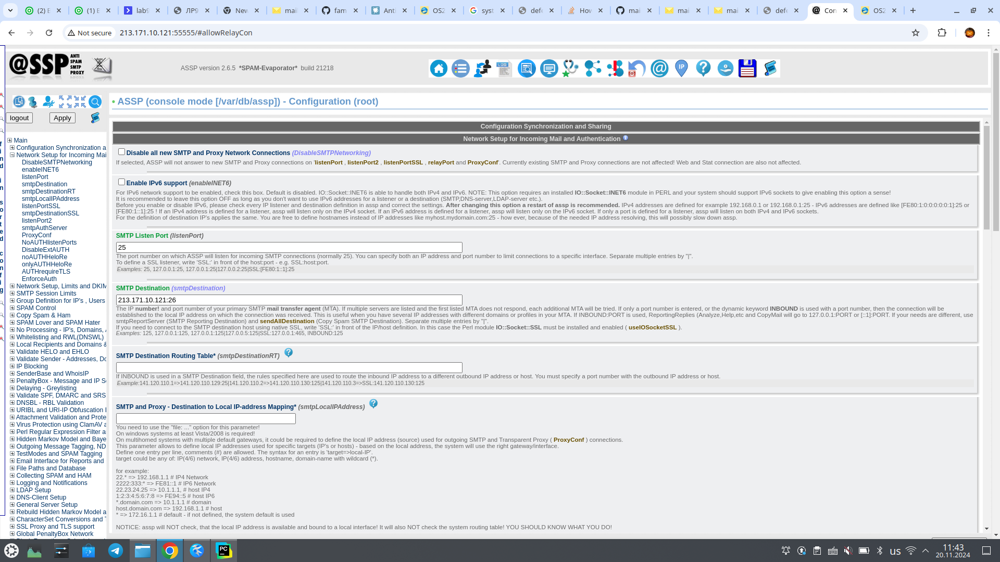

# Отчёт по лабораторной работе №9

## Выполненные шаги

### Часть 2

[//]: # ()
[//]: # (1. Устанавливаем зависимости - sudo apt-get install libgmp10 unzip pax sysstat sqlite3 dnsmasq wget libaio1)

[//]: # ()
[//]: # (2. Меняем имя хоста - nano /etc/hostname mail.sit.local)

[//]: # ()
[//]: # (3. узнаём публичный ip через ifconfig)

[//]: # ()
[//]: # (4. вносим запись в /etc/hosts 5.23.53.194 mail.sit.local mail)

[//]: # ()
[//]: # (5. вносим изменения в /etc/dnsmasq.conf)

[//]: # ()
[//]: # (```)

[//]: # (server=5.23.53.194)

[//]: # (domain=sit.local)

[//]: # (mx-host=sit.local, mail.sit.local, 5)

[//]: # (mx-host=mail.sit.local, mail.sit.local, 5)

[//]: # (listen-address=127.0.0.1)

[//]: # (```)

[//]: # ()
[//]: # (6. Скачиваем Zimbra Collaboration server - wget https://files.zimbra.com/downloads/10.1.0_GA/zcs-NETWORK-10.1.0_GA_4655.UBUNTU22_64.20240819064312.tgz)

[//]: # ()
[//]: # (7. Разархивируем - tar -xzf *.tgz)

[//]: # ()
[//]: # (8. Устанавливаем с помощью */install.sh, все пакеты кроме zimbra-dnscache )

[//]: # ()
[//]: # (9. Настраиваем zimbra)

[//]: # ()
[//]: # (![image]&#40;images/1.png&#41;)

[//]: # ()

1. Настраиваем 2 виртуальные машины в облаке с помощью terraform

2. Конфигурируем докер на хостах с помощью ansible - just ans

3. Разворачиваем mailcow на 2 машинах

- git clone https://github.com/mailcow/mailcow-dockerized.git
- cd ma*
- sed -i 's\MYSQL\MARIADB\g' docker-compose.yml 
- bash generate_config.sh
- docker compose pull && docker compose up -d
- bash helper-scripts/mailcow-reset-admin.sh




4. Настраиваем домен и почтовый ящик


5. Разворачиваем ANTISPAM PROXY SERVER на 2 хосту

- git clone https://github.com/fametec/assp.git
- cd assp
- docker compose pull && docker compose up -d



URL: http://<ip_address>:55555

User: root

Password: nospam4me

6. Настраиваем ASPS на проксирование на mailcow - https://ru.ecomstation.ru/showarticle.php?id=141

Проксирование:


